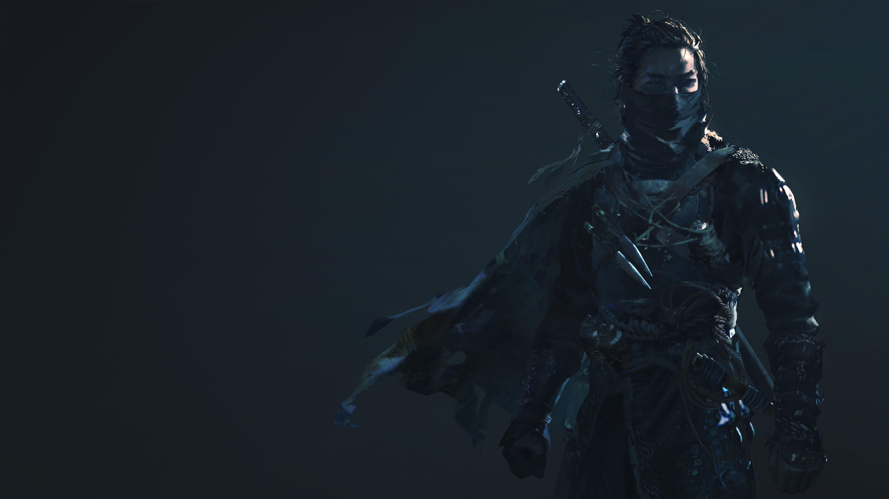

# PnPCompanion
## Features
- Saving & Loading
- Rulesystem
    - Node:
        - Name
        - Description
          - can have html and markdown
          - add "links" to other rules in the system: `{OtherRule}` it then gets converted to a link. links display the linked rule as tooltip (name & description)
          - Scroll to Node on click
        - Chapter rules
            - define rules as chapter -> when explicitly viewed load only it and its children
    - Editable
    - Hyrachie

## Roadmap
### Rulesystem:
- Node Hyrachie
    - **//TODO** change parents
    - **//TODO** delete rules
- Handle indexing better
- **Module System**
    - Import/Export multiple different modules for session
    - Mark different parent nodes as saved to other file
    - Modules have to expect other modules names
        - e.g: Root of Mod1 is child to "Mods" of core ruleset
        - e.g: Rule is parent to existing rule 
            - as new spell
            - as extension of the rule
            - ...
- **Style**
    - Background image (custom path / per Chapter)
- **QOL**:
    - can only edit one rule at a time (closes the others)
    - add dialog for description 
        - html/markdown table creation
        - html image inlining
    - **//TODO** "Template" rule for creating children faster useful for e.g: Beasts, Spells, Classes... `//TODO templates`

### CharacterSheet
- Custom png for background
- "item placer"
    - better name
    - drag & drop items on to the sheet
        - list for zb rules
        - text displays for values
        - link rules to display
- character creation
    - like dnd beyond

### Story Editor
- mindMap style event editor
- ai backend (for story generation)

### Map
- map with nodes, can be edited by the user.
    - nodes link to rules
    - maybe new tab "locations"
    - sub maps, (optional per node, eg world map, Node Town1>Town1 map ...)
        - continuous zoom

### Export
- Pdf export
    - export entire rule engine as formatted pdf
    - export also adventures

### Multiplayer
- Fog of War for players
    - map that is visible
    - items, that are unknown
    - spezies that are unknown

### Tech
- **//TODO** move static RuleNodeManager class to qml with a QtObject interface 

## Resources Used:
- <a href="https://www.flaticon.com/free-icons/manuscript" title="manuscript icons">Manuscript icon created by Freepik - Flaticon</a>  
- Ninja Wallpaper from Wallpaper-flare // TODO make link 